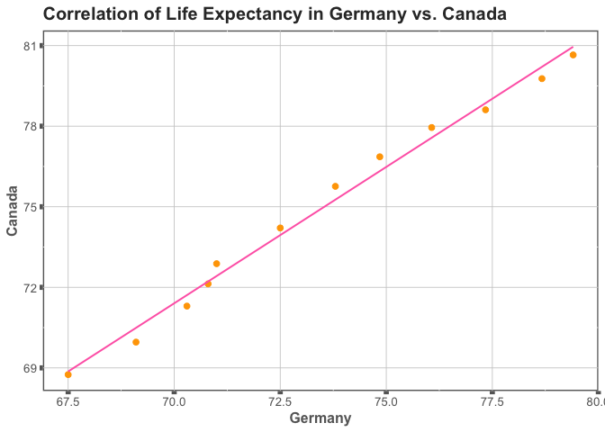
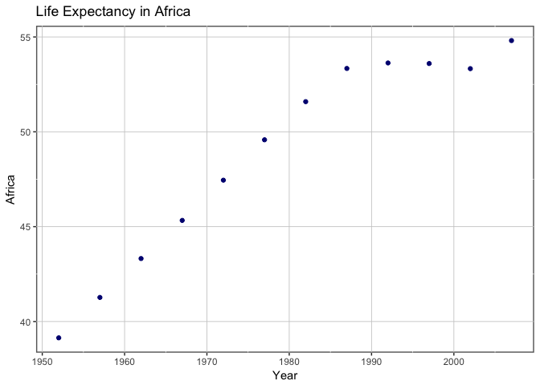
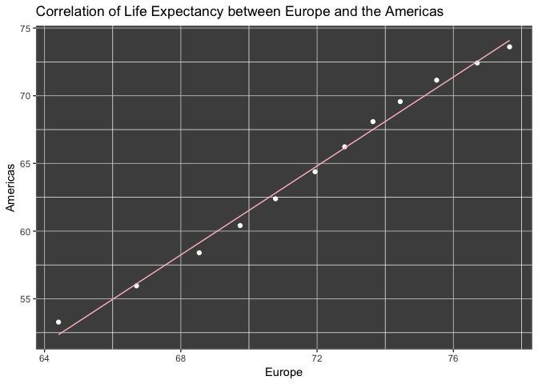
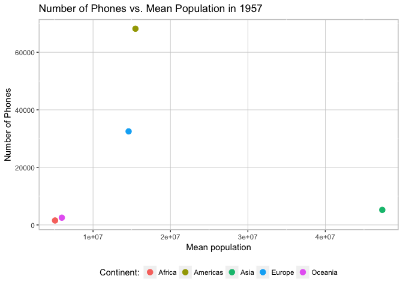

Homework 04: Tidy data and joins
================
Frederike Basedow
9 Oktober 2018

Here are the packages that I will use for this homework:

``` r
library(gapminder)
library(tidyverse)
library(knitr)
```

### 1. Data Reshaping

##### Activity \#2

-   *Make a tibble with one row per year and columns for life expectancy for two or more countries.*
    -   *Use `knitr::kable()` to make this table look pretty in your rendered homework.*
    -   *Take advantage of this new data shape to scatterplot life expectancy for one country against that of another.*

First, I will filter out the data from Germany (where I'm from) and Canada (where I live now) in the `gapminder` data set.

``` r
LE_C_Ge <- gapminder %>%
  group_by(year) %>%
  filter(country %in% c("Canada", "Germany")) %>%
  select(country, lifeExp, year) # select only important columns

kable(head(LE_C_Ge))
```

| country |  lifeExp|  year|
|:--------|--------:|-----:|
| Canada  |    68.75|  1952|
| Canada  |    69.96|  1957|
| Canada  |    71.30|  1962|
| Canada  |    72.13|  1967|
| Canada  |    72.88|  1972|
| Canada  |    74.21|  1977|

Next, I will `spread` this data so that it is easier to view in a table. I will make one column per country, which will contain the life expectancy data for that country:

``` r
untidy_LE_C_Ge <- spread(LE_C_Ge, key = "country", value = lifeExp)

kable(untidy_LE_C_Ge, col.names = c("Year", "Canada", "Germany"))
```

|  Year|  Canada|  Germany|
|-----:|-------:|--------:|
|  1952|  68.750|   67.500|
|  1957|  69.960|   69.100|
|  1962|  71.300|   70.300|
|  1967|  72.130|   70.800|
|  1972|  72.880|   71.000|
|  1977|  74.210|   72.500|
|  1982|  75.760|   73.800|
|  1987|  76.860|   74.847|
|  1992|  77.950|   76.070|
|  1997|  78.610|   77.340|
|  2002|  79.770|   78.670|
|  2007|  80.653|   79.406|

This table shows the life expectancy in Canada and Germany per year. I will plot this in a scatter plot to see if there is a correlation in life expectany between Canada and Germany. I will play around with the `theme` options from `ggplot2` for practice.

``` r
untidy_LE_C_Ge %>%
  ggplot(aes(Germany, Canada)) +
  geom_point(size = 2, colour = "orange") +
  geom_smooth(method = lm, se = FALSE, size = 0.7, colour = "hotpink") +
  labs(title = "Correlation of Life Expectancy in Germany vs. Canada") +
  theme(
    panel.background = element_rect(
      fill = "white",
      colour = "grey40",
      size = 1
    ),
    panel.grid.major = element_line(
      colour = "grey80",
      size = 0.3
    ),
    axis.text = element_text(
      colour = "grey40",
      size = 10
    ),
    axis.ticks = element_line(
      size = 2,
      colour = "grey40"
    ),
    axis.title.y = element_text(
      size = 12,
      colour = "grey40",
      face = "bold"
    ),
    axis.title.x = element_text(
      size = 12,
      colour = "grey40",
      face = "bold"
    ),
    plot.title = element_text(
      size = 15,
      colour = "grey20",
      face = "bold"
    )
  )
```



Looks like there's a positive correlation in life expectancy between Canada and Germany.

##### Activity \#3

-   *Compute some measure of life expectancy (mean? median? min? max?) for all possible combinations of continent and year. Reshape that to have one row per year and one variable for each continent. Or the other way around: one row per continent and one variable per year.*
    -   *Use `knitr::kable()` to make these tables look pretty in your rendered homework.*
    -   *Is there a plot that is easier to make with the data in this shape versis the usual form? If so (or you think so), try it! Reflect.*

I will compute the mean of the life expectancy per continent for each year and then reshape the data frame so that each continent has one row.

``` r
mean_lE <- gapminder %>%
  group_by(year, continent) %>%
  summarize(mean = round(mean(lifeExp), 2))

kable(head(mean_lE))
```

|  year| continent |   mean|
|-----:|:----------|------:|
|  1952| Africa    |  39.14|
|  1952| Americas  |  53.28|
|  1952| Asia      |  46.31|
|  1952| Europe    |  64.41|
|  1952| Oceania   |  69.25|
|  1957| Africa    |  41.27|

``` r
untidy_meanlE <- spread(mean_lE, key = "continent", value = mean)

kable(untidy_meanlE, col.names = c("Year", names(untidy_meanlE[2:6])))
```

|  Year|  Africa|  Americas|   Asia|  Europe|  Oceania|
|-----:|-------:|---------:|------:|-------:|--------:|
|  1952|   39.14|     53.28|  46.31|   64.41|    69.25|
|  1957|   41.27|     55.96|  49.32|   66.70|    70.30|
|  1962|   43.32|     58.40|  51.56|   68.54|    71.09|
|  1967|   45.33|     60.41|  54.66|   69.74|    71.31|
|  1972|   47.45|     62.39|  57.32|   70.78|    71.91|
|  1977|   49.58|     64.39|  59.61|   71.94|    72.85|
|  1982|   51.59|     66.23|  62.62|   72.81|    74.29|
|  1987|   53.34|     68.09|  64.85|   73.64|    75.32|
|  1992|   53.63|     69.57|  66.54|   74.44|    76.94|
|  1997|   53.60|     71.15|  68.02|   75.51|    78.19|
|  2002|   53.33|     72.42|  69.23|   76.70|    79.74|
|  2007|   54.81|     73.61|  70.73|   77.65|    80.72|

With this new data frame, we can plot the life expectancy over time for individual continents without filtering:

``` r
untidy_meanlE %>%
  ggplot(aes(year, Africa)) +
  geom_point(colour = "navy") +
  labs(title = "Life Expectancy in Africa", x = "Year") +
  theme(
    panel.background = element_rect(
      fill = "white",
      colour = "grey40",
      size = 1
    ),
    panel.grid.major = element_line(
      colour = "grey80",
      size = 0.3
    )
  )
```



The original y-axis title is "Africa" though, while it is actually life expectancy being plotted. I decided to not change it to make that clear.

We can also plot how two continents' life expectancy relate to each other:

``` r
untidy_meanlE %>%
  ggplot(aes(Europe, Americas)) +
  geom_point(colour = "white") +
  labs(title = "Correlation of Life Expectancy between Europe and the Americas") +
  geom_smooth(method = lm, se = FALSE, size = 0.5, colour = "pink") +
  theme(
    panel.background = element_rect(
      fill = "grey30",
      colour = "grey40",
      size = 1
    ),
    panel.grid.major = element_line(
      colour = "grey80",
      size = 0.3
    )
  )
```



This graph shows a positive relationship in life expectancy change over time between Europe and the Americas.

### 2. Data joining

##### Activity \#1

-   *Create a second data frame, complementary to Gapminder. Join this with (part of) Gapminder using a `dplyr` join function and make some observations about the process and result. Explore the different types of joins. Examples of a second data frame you could build:*
    -   *One row per country, a country variable and one or more variables with extra info, such as language spoken, NATO membership, national animal, or capitol city.*
    -   *One row per continent, a continent variable and one or more variables with extra info, such as northern versus southern hemisphere.*

I had a look at the data sets included in R, using the `data() function` and found `WorldPhones`, which includes the number of phones in each continent in different years.

It may be interesting to see if the number of phones is related to the population in each continent. To have a look at this, I will add the `WorldPhones` information to a subset of `gapminder` that includes the mean population in each continent per year.

Let's have a look at the `WorldPhones` data set first:

``` r
kable(WorldPhones)
```

|      |  N.Amer|  Europe|  Asia|  S.Amer|  Oceania|  Africa|  Mid.Amer|
|------|-------:|-------:|-----:|-------:|--------:|-------:|---------:|
| 1951 |   45939|   21574|  2876|    1815|     1646|      89|       555|
| 1956 |   60423|   29990|  4708|    2568|     2366|    1411|       733|
| 1957 |   64721|   32510|  5230|    2695|     2526|    1546|       773|
| 1958 |   68484|   35218|  6662|    2845|     2691|    1663|       836|
| 1959 |   71799|   37598|  6856|    3000|     2868|    1769|       911|
| 1960 |   76036|   40341|  8220|    3145|     3054|    1905|      1008|
| 1961 |   79831|   43173|  9053|    3338|     3224|    2005|      1076|

``` r
class(WorldPhones)
```

    ## [1] "matrix"

First, I will have to get `WorldPhones` ready for its merge with `gapminder`. It is a matrix, which is harder to work with, so I will change it into a data frame. The years are currently the rownames, so I will make them into a column (as they are in `gapminder`). Finally, I will combine North America, South America and Middle America to one continent "Americas" as it is used in the gapminder data set.

``` r
new_WP <- WorldPhones %>%
  as.data.frame() %>%
  rownames_to_column("year") %>%
  mutate(Americas = N.Amer + S.Amer + Mid.Amer) %>%
  select(-N.Amer, -S.Amer, -Mid.Amer) # deselect the orginal columns

kable(new_WP, col.names = c("Year", names(new_WP[2:6]))) # change column name of "year" column to "Year" for presentation with kable
```

| Year |  Europe|  Asia|  Oceania|  Africa|  Americas|
|:-----|-------:|-----:|--------:|-------:|---------:|
| 1951 |   21574|  2876|     1646|      89|     48309|
| 1956 |   29990|  4708|     2366|    1411|     63724|
| 1957 |   32510|  5230|     2526|    1546|     68189|
| 1958 |   35218|  6662|     2691|    1663|     72165|
| 1959 |   37598|  6856|     2868|    1769|     75710|
| 1960 |   40341|  8220|     3054|    1905|     80189|
| 1961 |   43173|  9053|     3224|    2005|     84245|

Let's make it tidy so that it's the same style as `gapminder`. Instead of having one column per continent, we need one column that contains the different continents and one with the number of phones. We can use the `gather` function for that:

``` r
tidy_newWP <-
  new_WP %>%
  gather(key = "continent", value = "n_phones", Europe:Americas) # if I don't specify which columns are part of the "key", the years will be taken as continents, too.

kable(head(tidy_newWP, 10))
```

| year | continent |  n\_phones|
|:-----|:----------|----------:|
| 1951 | Europe    |      21574|
| 1956 | Europe    |      29990|
| 1957 | Europe    |      32510|
| 1958 | Europe    |      35218|
| 1959 | Europe    |      37598|
| 1960 | Europe    |      40341|
| 1961 | Europe    |      43173|
| 1951 | Asia      |       2876|
| 1956 | Asia      |       4708|
| 1957 | Asia      |       5230|

Now we're almost ready to join, but there is still one problem. In order to join `tidy_newWP` with `gapminder`, the joining variables need to be of the same class in the two data sets. I want to join by `year` and `continent` so let's check if these are the same in `gapminder` and in my `tidy_newWP`.

``` r
class(gapminder$year) == class(tidy_newWP$year)
```

    ## [1] FALSE

``` r
class(gapminder$continent) == class(tidy_newWP$continent)
```

    ## [1] FALSE

They are not the same. Let's see of what class they are:

``` r
class(gapminder$year)
```

    ## [1] "integer"

``` r
class(tidy_newWP$year)
```

    ## [1] "character"

``` r
class(gapminder$continent)
```

    ## [1] "factor"

``` r
class(tidy_newWP$continent)
```

    ## [1] "character"

The `year` variable in `gapminder` is of the class integer and the `continent` variable is a factor, while both variables in `tidy_newWP` are characters. Let's adjust `tidy_newWP` so that the variable class matches the one in `gapminder`.

``` r
tidy_newWP$year <- as.integer(tidy_newWP$year)
tidy_newWP$continent <- as.factor(tidy_newWP$continent)

class(gapminder$year) == class(tidy_newWP$year)
```

    ## [1] TRUE

``` r
class(gapminder$continent) == class(tidy_newWP$continent)
```

    ## [1] TRUE

Great, now the `WorldPhones` data is ready to join! Now I just need to extract the `gapminder` data that I would like to use. I will calculate the average population per continent per year.

``` r
pop_GM <-
  gapminder %>%
  group_by(year, continent) %>%
  summarize(mean_pop = mean(pop))

kable(head(pop_GM, 10))
```

|  year| continent |  mean\_pop|
|-----:|:----------|----------:|
|  1952| Africa    |    4570010|
|  1952| Americas  |   13806098|
|  1952| Asia      |   42283556|
|  1952| Europe    |   13937362|
|  1952| Oceania   |    5343003|
|  1957| Africa    |    5093033|
|  1957| Americas  |   15478157|
|  1957| Asia      |   47356988|
|  1957| Europe    |   14596345|
|  1957| Oceania   |    5970988|

Let's finally try to add the `WorldPhones` data to that! I will start with a `full_join` that combines all data from both data sets. I will join the data sets by both year and continent.

``` r
pop_phone <- full_join(pop_GM, tidy_newWP, by = c("year", "continent"))

kable(head(pop_phone, 10)) # show first ten rows
```

|  year| continent |  mean\_pop|  n\_phones|
|-----:|:----------|----------:|----------:|
|  1952| Africa    |    4570010|         NA|
|  1952| Americas  |   13806098|         NA|
|  1952| Asia      |   42283556|         NA|
|  1952| Europe    |   13937362|         NA|
|  1952| Oceania   |    5343003|         NA|
|  1957| Africa    |    5093033|       1546|
|  1957| Americas  |   15478157|      68189|
|  1957| Asia      |   47356988|       5230|
|  1957| Europe    |   14596345|      32510|
|  1957| Oceania   |    5970988|       2526|

``` r
kable(tail(pop_phone, 10)) # show last ten rows
```

|  year| continent |  mean\_pop|  n\_phones|
|-----:|:----------|----------:|----------:|
|  1958| Africa    |         NA|       1663|
|  1959| Africa    |         NA|       1769|
|  1960| Africa    |         NA|       1905|
|  1961| Africa    |         NA|       2005|
|  1951| Americas  |         NA|      48309|
|  1956| Americas  |         NA|      63724|
|  1958| Americas  |         NA|      72165|
|  1959| Americas  |         NA|      75710|
|  1960| Americas  |         NA|      80189|
|  1961| Americas  |         NA|      84245|

Printing the ten first and last rows, we can see that there are a lot of missing values in both the `mean_pop` column and the `n_phones` column. This is because `full_join` keeps all levels of both the `year` and `continent` variable, but only one of the years actually overlaps between the two data sets, as you can see here:

``` r
intersect(gapminder$year, tidy_newWP$year)
```

    ## [1] 1957

Only year 1957 is present in both data sets. Let's join the data sets with only the data that is present in both. We can use the `inner_join` function for that.

``` r
pop_phone_inner <- inner_join(pop_GM, tidy_newWP, by = c("year", "continent"))

kable(pop_phone_inner)
```

|  year| continent |  mean\_pop|  n\_phones|
|-----:|:----------|----------:|----------:|
|  1957| Africa    |    5093033|       1546|
|  1957| Americas  |   15478157|      68189|
|  1957| Asia      |   47356988|       5230|
|  1957| Europe    |   14596345|      32510|
|  1957| Oceania   |    5970988|       2526|

Now we have a short data frame that only contains the population and number of phones data from 1957 in each continent.

We can also figure out which data is the same in the two data sets by using the filtering join `semi_join`.

``` r
pop_phone_semi <- semi_join(pop_GM, tidy_newWP, by = c("year", "continent"))

kable(pop_phone_semi)
```

|  year| continent |  mean\_pop|
|-----:|:----------|----------:|
|  1957| Africa    |    5093033|
|  1957| Americas  |   15478157|
|  1957| Asia      |   47356988|
|  1957| Europe    |   14596345|
|  1957| Oceania   |    5970988|

We can see that only data from year 1957 is kept, but the n\_phones data from `tidy_newWP` is not added. If we flip around the order in which the data sets are entered we also only get data from 1957, but the gapminder-specific data is lacking:

``` r
pop_phone_semi2 <- semi_join(tidy_newWP, pop_GM, by = c("year", "continent"))

kable(pop_phone_semi2)
```

|  year| continent |  n\_phones|
|-----:|:----------|----------:|
|  1957| Europe    |      32510|
|  1957| Asia      |       5230|
|  1957| Oceania   |       2526|
|  1957| Africa    |       1546|
|  1957| Americas  |      68189|

We can also use `anti_join` to see which data is not overlapping, for example if we want to look at the number of phones in the years that are not included in gapminder:

``` r
pop_phone_anti <- anti_join(tidy_newWP, pop_GM, by = c("year", "continent"))

kable(head(pop_phone_anti))
```

|  year| continent |  n\_phones|
|-----:|:----------|----------:|
|  1951| Europe    |      21574|
|  1956| Europe    |      29990|
|  1958| Europe    |      35218|
|  1959| Europe    |      37598|
|  1960| Europe    |      40341|
|  1961| Europe    |      43173|

To try out all different joining options, I will use `left_join` and `right_join` next. `left_join` will only join the rows of `tidy_newWP` to `pop_GM` that are matching (if used in the order below).

``` r
pop_phone_left <- left_join(pop_GM, tidy_newWP, by = c("year", "continent"))

kable(head(pop_phone_left, 20))
```

|  year| continent |  mean\_pop|  n\_phones|
|-----:|:----------|----------:|----------:|
|  1952| Africa    |    4570010|         NA|
|  1952| Americas  |   13806098|         NA|
|  1952| Asia      |   42283556|         NA|
|  1952| Europe    |   13937362|         NA|
|  1952| Oceania   |    5343003|         NA|
|  1957| Africa    |    5093033|       1546|
|  1957| Americas  |   15478157|      68189|
|  1957| Asia      |   47356988|       5230|
|  1957| Europe    |   14596345|      32510|
|  1957| Oceania   |    5970988|       2526|
|  1962| Africa    |    5702247|         NA|
|  1962| Americas  |   17330810|         NA|
|  1962| Asia      |   51404763|         NA|
|  1962| Europe    |   15345172|         NA|
|  1962| Oceania   |    6641759|         NA|
|  1967| Africa    |    6447875|         NA|
|  1967| Americas  |   19229865|         NA|
|  1967| Asia      |   57747361|         NA|
|  1967| Europe    |   16039299|         NA|
|  1967| Oceania   |    7300207|         NA|

Similar to that is `right_join` which will only join rows of `pop_GM` that are matching in `tidy_newWP` (if used in the order below).

``` r
pop_phone_right <- right_join(pop_GM, tidy_newWP, by = c("year", "continent"))

kable(head(pop_phone_right, 20))
```

|  year| continent |  mean\_pop|  n\_phones|
|-----:|:----------|----------:|----------:|
|  1951| Europe    |         NA|      21574|
|  1956| Europe    |         NA|      29990|
|  1957| Europe    |   14596345|      32510|
|  1958| Europe    |         NA|      35218|
|  1959| Europe    |         NA|      37598|
|  1960| Europe    |         NA|      40341|
|  1961| Europe    |         NA|      43173|
|  1951| Asia      |         NA|       2876|
|  1956| Asia      |         NA|       4708|
|  1957| Asia      |   47356988|       5230|
|  1958| Asia      |         NA|       6662|
|  1959| Asia      |         NA|       6856|
|  1960| Asia      |         NA|       8220|
|  1961| Asia      |         NA|       9053|
|  1951| Oceania   |         NA|       1646|
|  1956| Oceania   |         NA|       2366|
|  1957| Oceania   |    5970988|       2526|
|  1958| Oceania   |         NA|       2691|
|  1959| Oceania   |         NA|       2868|
|  1960| Oceania   |         NA|       3054|

To compare the population with number of phones, the `pop_phone_inner` output seems most useful. I will use it to plot mean population vs. number of phones. Note, that I could also use the output from `full_join`, `left_join`, or `right_join`, but I would probably have to filter for the year 1957.

``` r
pop_phone_inner %>%
  ggplot(aes(mean_pop, n_phones, colour = continent)) +
  geom_point(size = 3) +
  labs(
    title = "Number of Phones vs. Mean Population in 1957",
    x = "Mean population",
    y = "Number of Phones",
    colour = "Continent:"
  ) +
  theme(
    legend.position = "bottom",
    panel.background = element_rect(
      fill = "white",
      colour = "grey80",
      size = 1
    ),
    panel.grid.major = element_line(
      colour = "grey80",
      size = 0.3
    )
  )
```



It looks like there is a higher number of phones in countries with higher population when looking at Africa, the Americas, Europe and Oceania, but Asia has a relatively low number of phones for its big population. However, we only have 5 independent values here and cannot draw any conclusions about a possible correlation. If we had numbers from different years we could see if the number of phones increases with an increasing population over time.
