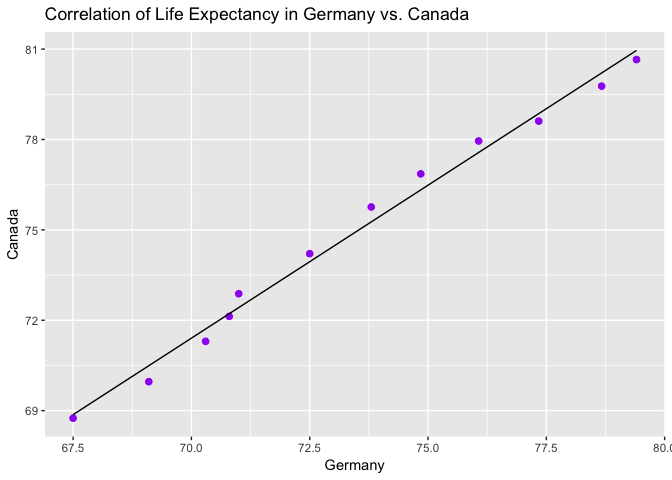

hw04-tidy data and joins
================
Frederike Basedow
7 Oktober 2018

Homework 04: Tidy data and joins
================================

Overview
--------

Due Tuesday 2018-10-09 at 23:59.

You have learned alot about data wrangling! You know how to use the tidyverse to:

-   Filter rows and select variables in a principled or name-based manner
-   Modify variables and create new variables
-   Group rows of a data frame and do summarizing or mutating computations within group
-   Reshape a data frame
-   Get new information into a data frame via a joining

The goal of this homework is to solidify your data wrangling skills by working some realistic problems in the grey area between data aggregation and data reshaping.

If you internalize that there are multiple solutions to most problems, you will spend less time banging your head against the wall in data analysis. If something's really hard, sneak up on it from a different angle.

### Evaluation

All rubrics listed on the [assignments](http://stat545.com/Classroom/assignments/) page are relevant for this assignment.

The Assignment
--------------

This is a "choose your own adventure"-style assignment, where you are expected to do the following two things:

1.  Pick one of the data reshaping prompts and do it.
2.  Pick one of the join prompts and do it.

It is fine to work with a new dataset and/or create variations on these problem themes.

``` r
library(gapminder)
library(tidyverse)
library(knitr)
```

### Data Reshaping Prompts (and relationship to aggregation)

**Problem**: You have data in one "shape" but you wish it were in another. Usually this is because the alternative shape is superior for presenting a table, making a figure, or doing aggregation and statistical analysis.

**Solution**: Reshape your data. For simple reshaping, `gather()` and `spread()` from `tidyr` will suffice. Do the thing that is possible / easier now that your data has a new shape.

**Prompts**:

Activity \#1

-   Make your own cheatsheet similar to Tyler Rinker's [minimal guide to `tidyr`](https://github.com/trinker/tidyr_in_a_nutshell).

Activity \#2

-   Make a tibble with one row per year and columns for life expectancy for two or more countries.
    -   Use `knitr::kable()` to make this table look pretty in your rendered homework.
    -   Take advantage of this new data shape to scatterplot life expectancy for one country against that of another.

``` r
LE_C_Ge <- gapminder %>% 
  group_by(year) %>% 
  filter(country %in% c("Canada", "Germany")) %>% 
  select(country, lifeExp, year)

kable(head(LE_C_Ge))
```

| country |  lifeExp|  year|
|:--------|--------:|-----:|
| Canada  |    68.75|  1952|
| Canada  |    69.96|  1957|
| Canada  |    71.30|  1962|
| Canada  |    72.13|  1967|
| Canada  |    72.88|  1972|
| Canada  |    74.21|  1977|

``` r
untidy_LE_C_Ge <- spread(LE_C_Ge, key="country", value=lifeExp)
untidy_LE_C_Ge
```

    ## # A tibble: 12 x 3
    ## # Groups:   year [12]
    ##     year Canada Germany
    ##    <int>  <dbl>   <dbl>
    ##  1  1952   68.8    67.5
    ##  2  1957   70.0    69.1
    ##  3  1962   71.3    70.3
    ##  4  1967   72.1    70.8
    ##  5  1972   72.9    71.0
    ##  6  1977   74.2    72.5
    ##  7  1982   75.8    73.8
    ##  8  1987   76.9    74.8
    ##  9  1992   78.0    76.1
    ## 10  1997   78.6    77.3
    ## 11  2002   79.8    78.7
    ## 12  2007   80.7    79.4

``` r
kable(untidy_LE_C_Ge, col.names = c("Year", "Canada", "Germany"))
```

|  Year|  Canada|  Germany|
|-----:|-------:|--------:|
|  1952|  68.750|   67.500|
|  1957|  69.960|   69.100|
|  1962|  71.300|   70.300|
|  1967|  72.130|   70.800|
|  1972|  72.880|   71.000|
|  1977|  74.210|   72.500|
|  1982|  75.760|   73.800|
|  1987|  76.860|   74.847|
|  1992|  77.950|   76.070|
|  1997|  78.610|   77.340|
|  2002|  79.770|   78.670|
|  2007|  80.653|   79.406|

This table shows the life expectancy in Canada in Germany per year.

``` r
untidy_LE_C_Ge%>% 
  ggplot(aes(Germany, Canada)) + 
  geom_point(size=2, colour="purple") +
  geom_smooth(method=lm, se=FALSE, size=0.5, colour="black") +
  labs(title="Correlation of Life Expectancy in Germany vs. Canada")
```



Looks like there's a positive correlation between life expectancy in Canada and Germany.

Activity \#3

-   Compute some measure of life expectancy (mean? median? min? max?) for all possible combinations of continent and year. Reshape that to have one row per year and one variable for each continent. Or the other way around: one row per continent and one variable per year.
    -   Use `knitr::kable()` to make these tables look pretty in your rendered homework.
    -   Is there a plot that is easier to make with the data in this shape versis the usual form? If so (or you think so), try it! Reflect.

Activity \#4

-   In [Window functions](http://stat545.com/block010_dplyr-end-single-table.html#window-functions), we formed a tibble with 24 rows: 2 per year, giving the country with both the lowest and highest life expectancy (in Asia). Take that table (or a similar one for all continents) and reshape it so you have one row per year or per year \* continent combination.

Activity \#5

-   Previous TA Andrew MacDonald has a nice [data manipulation sampler](https://gist.github.com/aammd/11386424). Make up a similar set of exercises for yourself, in the abstract or (even better) using Gapminder or other data, and solve them.

### Join Prompts (join, merge, look up)

**Problem**: You have two data sources and you need info from both in one new data object.

**Solution**: Perform a **join**, which borrows terminology from the database world, specifically SQL.

**Prompts**:

Activity \#1

-   Create a second data frame, complementary to Gapminder. Join this with (part of) Gapminder using a `dplyr` join function and make some observations about the process and result. Explore the different types of joins. Examples of a second data frame you could build:
    -   One row per country, a country variable and one or more variables with extra info, such as language spoken, NATO membership, national animal, or capitol city.
    -   One row per continent, a continent variable and one or more variables with extra info, such as northern versus southern hemisphere.

I had a look at the data sets included in R, using the `data() function` and found the `WorldPhones` data set which includes the number of phones in each continent in different years.

``` r
kable(WorldPhones)
```

|      |  N.Amer|  Europe|  Asia|  S.Amer|  Oceania|  Africa|  Mid.Amer|
|------|-------:|-------:|-----:|-------:|--------:|-------:|---------:|
| 1951 |   45939|   21574|  2876|    1815|     1646|      89|       555|
| 1956 |   60423|   29990|  4708|    2568|     2366|    1411|       733|
| 1957 |   64721|   32510|  5230|    2695|     2526|    1546|       773|
| 1958 |   68484|   35218|  6662|    2845|     2691|    1663|       836|
| 1959 |   71799|   37598|  6856|    3000|     2868|    1769|       911|
| 1960 |   76036|   40341|  8220|    3145|     3054|    1905|      1008|
| 1961 |   79831|   43173|  9053|    3338|     3224|    2005|      1076|

Lets combine North America, South America and Mid America to one continent "Americas" as it is used in the gapminder data set

``` r
new_WP <- WorldPhones %>% 
  as.data.frame() %>% 
  rownames_to_column("year") %>% 
  mutate(Americas = N.Amer + S.Amer + Mid.Amer) %>% 
  select(-N.Amer, -S.Amer, -Mid.Amer)

new_WP
```

    ##   year Europe Asia Oceania Africa Americas
    ## 1 1951  21574 2876    1646     89    48309
    ## 2 1956  29990 4708    2366   1411    63724
    ## 3 1957  32510 5230    2526   1546    68189
    ## 4 1958  35218 6662    2691   1663    72165
    ## 5 1959  37598 6856    2868   1769    75710
    ## 6 1960  40341 8220    3054   1905    80189
    ## 7 1961  43173 9053    3224   2005    84245

Let's make it tidy so that it's the same style as gapminder

``` r
tidy_newWP <- 
  new_WP %>% 
  gather(key="continent", value="n_phones", Europe:Americas) 

tidy_newWP$year <- as.integer(tidy_newWP$year)
tidy_newWP$continent <- as.factor(tidy_newWP$continent)


kable(tidy_newWP)
```

|  year| continent |  n\_phones|
|-----:|:----------|----------:|
|  1951| Europe    |      21574|
|  1956| Europe    |      29990|
|  1957| Europe    |      32510|
|  1958| Europe    |      35218|
|  1959| Europe    |      37598|
|  1960| Europe    |      40341|
|  1961| Europe    |      43173|
|  1951| Asia      |       2876|
|  1956| Asia      |       4708|
|  1957| Asia      |       5230|
|  1958| Asia      |       6662|
|  1959| Asia      |       6856|
|  1960| Asia      |       8220|
|  1961| Asia      |       9053|
|  1951| Oceania   |       1646|
|  1956| Oceania   |       2366|
|  1957| Oceania   |       2526|
|  1958| Oceania   |       2691|
|  1959| Oceania   |       2868|
|  1960| Oceania   |       3054|
|  1961| Oceania   |       3224|
|  1951| Africa    |         89|
|  1956| Africa    |       1411|
|  1957| Africa    |       1546|
|  1958| Africa    |       1663|
|  1959| Africa    |       1769|
|  1960| Africa    |       1905|
|  1961| Africa    |       2005|
|  1951| Americas  |      48309|
|  1956| Americas  |      63724|
|  1957| Americas  |      68189|
|  1958| Americas  |      72165|
|  1959| Americas  |      75710|
|  1960| Americas  |      80189|
|  1961| Americas  |      84245|

Let's select the GDP per capita data from gapminder per continent per year and add the phone data to that

``` r
gdp_GM <-
  gapminder %>% 
  group_by(year, continent) %>% 
  select(year, continent, gdpPercap)

kable(head(gdp_GM))
```

|  year| continent |  gdpPercap|
|-----:|:----------|----------:|
|  1952| Asia      |   779.4453|
|  1957| Asia      |   820.8530|
|  1962| Asia      |   853.1007|
|  1967| Asia      |   836.1971|
|  1972| Asia      |   739.9811|
|  1977| Asia      |   786.1134|

``` r
gdp_phone <- full_join(gdp_GM, tidy_newWP, by=c("year", "continent"))

gdp_phone
```

    ## # A tibble: 1,734 x 4
    ## # Groups:   year, continent [?]
    ##     year continent gdpPercap n_phones
    ##    <int> <fct>         <dbl>    <dbl>
    ##  1  1952 Asia           779.      NA 
    ##  2  1957 Asia           821.    5230.
    ##  3  1962 Asia           853.      NA 
    ##  4  1967 Asia           836.      NA 
    ##  5  1972 Asia           740.      NA 
    ##  6  1977 Asia           786.      NA 
    ##  7  1982 Asia           978.      NA 
    ##  8  1987 Asia           852.      NA 
    ##  9  1992 Asia           649.      NA 
    ## 10  1997 Asia           635.      NA 
    ## # ... with 1,724 more rows

Activity \#2

-   Create your own cheatsheet patterned [after Jenny's](http://stat545.com/bit001_dplyr-cheatsheet.html) but focused on something you care about more than comics! Inspirational examples:
    -   Pets I have owned + breed + friendly vs. unfriendly + ??. Join to a table of pet breed, including variables for furry vs not furry, mammal true or false, etc.
    -   Movies and studios....
    -   Athletes and teams....

You will likely need to iterate between your data prep and your joining to make your explorations comprehensive and interesting. For example, you will want a specific amount (or lack) of overlap between the two data.frames, in order to demonstrate all the different joins. You will want both the data frames to be as small as possible, while still retaining the expository value.

Activity \#3

-   This is really an optional add-on to either of the previous activities.
-   Explore the base R function `merge()`, which also does joins. Compare and contrast with `dplyr` joins.
-   Explore the base R function `match()`, which is related to joins and merges, but is really more of a "table lookup". Compare and contrast with a true join/merge.

### Finishing up, and Reflection

Once you're done the above, go back to [UBC canvas](https://canvas.ubc.ca/), and find the "Homework 04" page.

You're encouraged to reflect on what was hard/easy, problems you solved, helpful tutorials you read, etc. As usual, put this reflection on your canvas submission. It can be brief.

Please add a link to your homework respository to help out our wonderful TA's.
